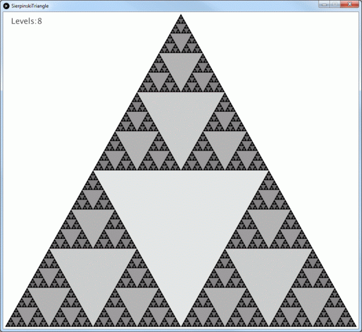
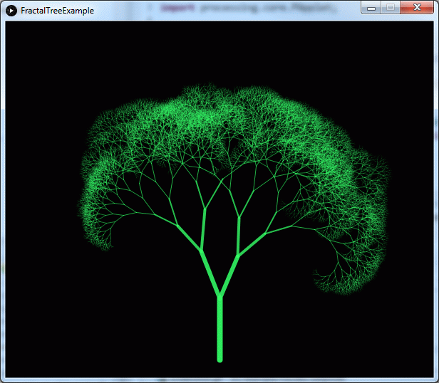
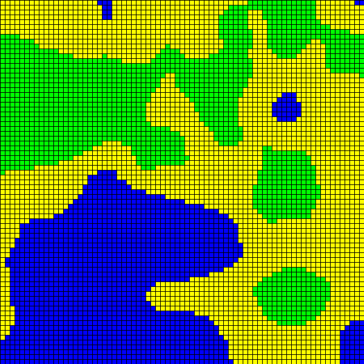

# processing-examples
A simple starter project with examples using the [Processing java library](https://processing.org/) and IntelliJ

In IntelliJ:
* Check out from Version Control-> Git
* _right-click_ and paste the following URL `git@github.com:cluder/processing-examples.git` 
* after the cloning is successful, click Yes to open the project.
* run the `ProcessingExample`

# Screenshots
## Fraktals
### Mandelbrot

### Sierpinski

### Fractal tree

### Perlin noise (tiles)

